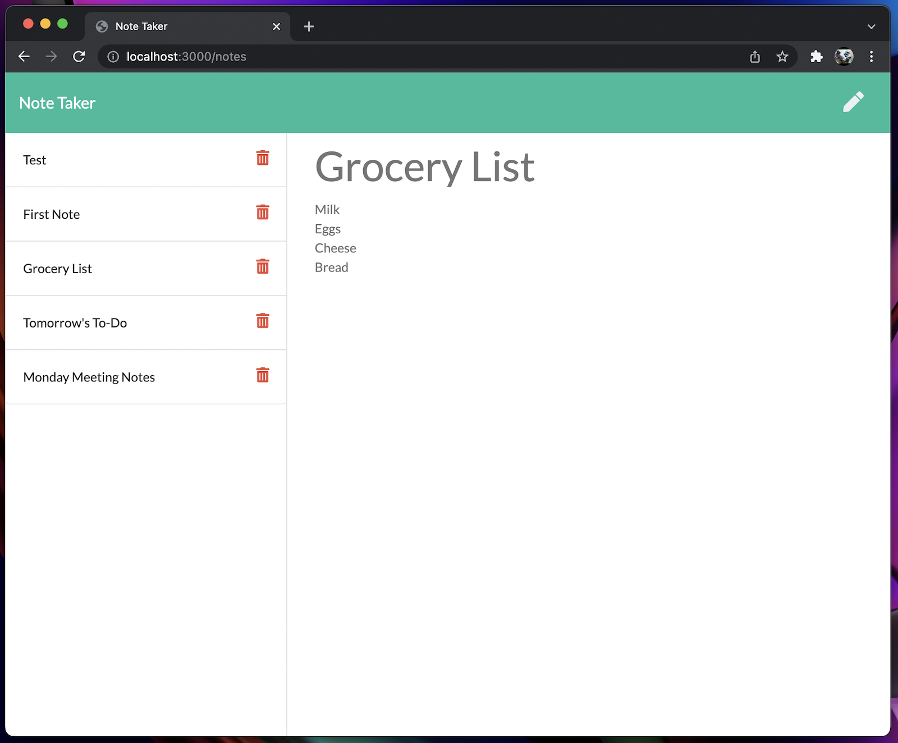
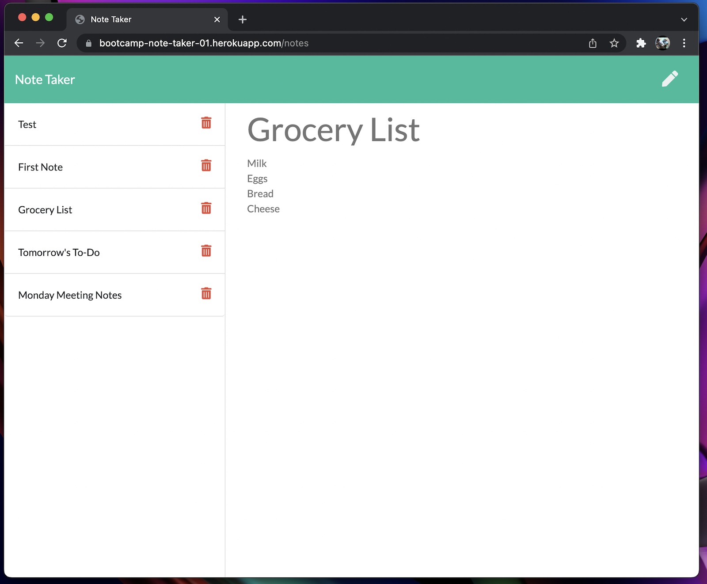

# README - Week 6 Homework 1 - Note Taker 

### By: [Bill Reising](#questions)

# View [Screencast](https://drive.google.com/file/d/1Ocn1TSM-fmQjHnd2AcLuf57ZUH3AHvea/view) - as of 2022-03-17 Heroku deployment is not working properly

---

## App Description

A command line utility to create a web based note taking application that is interactive.

---

**[Screencast](https://drive.google.com/file/d/1Ocn1TSM-fmQjHnd2AcLuf57ZUH3AHvea/view)**

---
- Localhost:

- Heroku

---

## Table of Contents
- [Instalation Instructions](#install)
- [Command to Use](#command)
- [Instructions](#instructions)
- [Contribution Guidlines](#contribution)
- [Tests](#tests)
- [License](#license)
- [Questions](#questions)

---

## Installation Instructions

Copy the folder to a server running Node and install Express, FS, UUID, and Path.

## Command to use:

<code>nodemon server.js</code>

## Instructions:

Run `npm i` and then `nodemon server.js`. Then navigate to localhost:3000

or

visit - https://bootcamp-note-taker-01.herokuapp.com/

## Contribution Guidlines

Be polite and provide examples.

## Tests

Unknown

## License: Apache 2.0

>Under this license, users can: Use the code commercially: Companies can include the licensed code in proprietary software that they then sell to customers.

---

## Questions:

Find the source for this project and more on **[GitHub](https://github.com/wreising).**

**[email](wreising@mac.com)** me with any further questions.

---

README generated by [README Generator](https://github.com/wreising/Week_5-Homework_1)

© 2022 William Reising

---